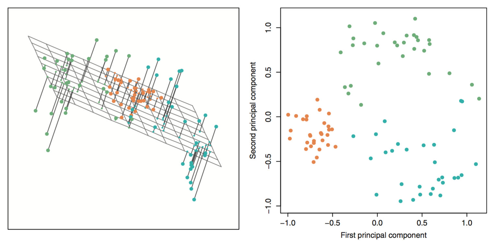

```{r echo = FALSE, warning=FALSE, message=FALSE}
library(knitr)
opts_chunk$set(warning = FALSE, message = FALSE)
```


## {.vcenter .flexbox}


## Ex: Fine Fragrance {.build}

```{r echo = FALSE}
experts <- read.table(file = "../data/perfumes.csv", header = TRUE, sep = ",",
                      dec = ".", quote= "\"")

library(dplyr)
experts <- experts %>%
  filter(Session == 1) %>%
  select(-Panelist, -Session, -Rank)
n <- names(experts)
names(experts) <- LETTERS[1:12]
experts <- experts %>%
  group_by(A) %>%
  summarize(Spicy = mean(B),
            Heady = mean(C),
            Fruity = mean(D),
            Green = mean(E),
            Vanilla = mean(F),
            Floral = mean(G),
            Woody = mean(H),
            Citrus = mean(I),
            Marine = mean(J),
            Greedy = mean(K),
            Oriental = mean(L)) %>%
  as.data.frame()
```

- 12 experts were asked to rate 12 perfumes on 11 scent adjectives.

```{r echo = FALSE}
names(experts)[-1]
names(experts)[1] <- "perfume"
```

- Each rating is on the scale 1 - 10.
- Ratings for each perfume were averaged across experts.


##

```{r}
head(experts)
```

## Learning structure{.build} 
- How do we visualize this data set?
- Representing *all* of the structure in the data requires $p = 11$ dimensions.
$$ {p \choose 2} = 55 \textrm{ possible scatterplots}$$ 
- Can we represent *most* of the structure using fewer dimensions?


##

```{r echo = FALSE, fig.height=5, fig.width = 5, fig.align='center'}
pca1 <- prcomp(experts[, -1], scale = TRUE)

library(ggplot2)
d <- as.data.frame(pca1$x)
d$perfume <- experts$perfume
levels(d$perfume)[levels(d$perfume)=="Cin\xe9ma"] <- "Cinema"
p1 <- ggplot(d, aes(x = PC1, y = PC2)) +
  geom_point() +
  geom_text(aes(label = perfume), position = position_nudge(y = -0.1), check_overlap = TRUE) +
  xlim(c(-5, 5)) +
  annotate("text", label = "J'adore ET", x = 3, y = .2)
p1
```


## Principle Component Analysis (PCA) {.build}

Produces a low-dimensional representation of a dataset. It finds a sequence of linear combinations of the variables that have maximal variance and are mutually uncorrelated.

Used to:

- Visualize structure in data
- Learn about latent meta-variables
- Produce imputs for subsequent supervised learning

#

## Dimension Reduction {.build .flexbox .vcenter}

Reducing from $p = 3$ to 2 principal components.




## Finding PCs {.build}

For each component, we want the $\phi$ vector that solves the optimization problem:

$$\textrm{max} \left(\frac{1}{n} \sum_{i = 1}^n z_{i1}^2 \right) \textrm{ subject to } \sum_{j = 1}^p \phi_{j1}^2 = 1$$

where each $z_{i1} = \sum_{j = 1}^p \phi_{j1}x_{ij}$.

Can be solved via an eigen decomposition ($z_i$: eigenvectors of the covariance matrix of $X$).

## Interpretation

The weights corresponding to a PC, $\phi_{j1}$, are called the *loadings*.

#### What does PC1 represent?
```{r echo = FALSE}
pca1$rotation[, 1]
```

Bright vs Dark?

## Interpretation

#### What does PC2 represent?
```{r echo = FALSE}
pca1$rotation[, 2]
```

Mellow vs piquant?

## Biplot

```{r echo = FALSE}
biplot(pca1)
```


## Ex. More Crime {.build}

This data set contains statistics, in arrests per 100,000 residents for assault, murder, and rape in each of the 50 US states in 1973. Also given is the percent of the population living in urban areas.

```{r}
head(USArrests)
```


## PCA {.build}

```{r}
pca1 <- prcomp(USArrests, scale = TRUE)
names(pca1)
```

- `rotation` holds the matrix of loadings; the $\phi$'s.
- `x` holds the scores for the principle components; the $z_{ij}$.

```{r}
pca1$rotation
```


##

```{r echo = FALSE, fig.height=5, fig.width = 5, fig.align='center'}
d <- as.data.frame(pca1$x)
d$state <- row.names(d)
p1 <- ggplot(d, aes(x = PC1, y = PC2)) +
  geom_point() +
  geom_text(aes(label = state), position = position_nudge(y = -0.1))
p1
```


## Interpretation {.build}

```{r}
pca1$rotation
```

- PC1: crime
- PC2: urbanization


## Biplot

```{r}
biplot(pca1)
```

#

## Interpretation {.build}

```{r}
pca1$rotation
names(pca1)
pca1$sdev
```

## Constructing a scree plot {.build}

Used to visualize the proportion of variance explained (PVE) by each PC.

```{r eval = FALSE}
d <- data.frame(PC = 1:4,
                PVE = pca1$sdev^2 / sum(pca1$sdev^2))
ggplot(d, aes(x = PC, y = PVE)) +
  geom_line() + 
  geom_point()
```

## Scree plot

```{r echo = FALSE}
d <- data.frame(PC = 1:4,
                PVE = pca1$sdev^2 / sum(pca1$sdev^2))
ggplot(d, aes(x = PC, y = PVE)) +
  geom_line() + 
  geom_point()
```

## How many PCs? {.build}

- 1st PC: 62% PVE
- 1st + 2nd PC: 62 + 25 = 87% PVE

Usually most of the structure is in the first several principal components, but results may vary!

*Rule of thumb*: look for the elbow in the scree plot.

